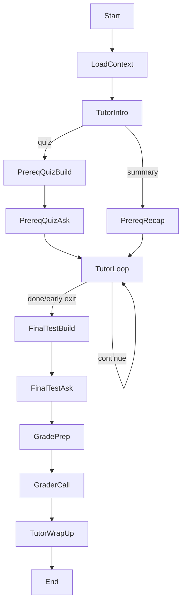

# Autodidact v0.4 Session Engine Implementation Plan

**Status:** Ready for Implementation  
**Created:** 2025-07-13  
**Purpose:** Complete replacement of current graph.py with new LangGraph-based learning session engine

## Overview

This document outlines the implementation of a new session engine that addresses key issues in the current system:
- Ensures ALL learning objectives are systematically taught
- Implements proper prerequisite handling with choice of summary or quiz
- Uses cost-optimized model selection (expensive only for grading)
- Provides comprehensive assessment with 6-question final test
- Supports early session termination while still assessing covered material

## Key Design Decisions

1. **Teaching Philosophy**: Teach ALL objectives with mastery < 0.7, skip those already mastered
2. **Assessment Strategy**: Formative micro-quizzes (not graded) + summative final test (graded)
3. **Grading**: Only grade final test responses, ignore conversation/micro-quizzes
4. **Early Exit**: Allow ending session early, but still test objectives that were covered
5. **Session Length**: 30-minute guideline is soft - sessions can be longer if needed
6. **Logging**: Markdown session logs instead of database transcripts

## Architecture

### File Structure
```
backend/
├── graph_v04.py          # Core LangGraph implementation
├── prompts_v04.py        # All prompt templates and configurations
├── session_state.py      # State definitions and helpers
├── session_logger.py     # Markdown logging functionality
├── quiz_generators.py    # Quiz generation logic
└── grader.py            # Grading logic with fallback handling
```

### LangGraph Flow


## Implementation Phases

### Phase 1: Core State & Infrastructure

#### SessionState Definition
```python
class SessionState(TypedDict):
    # Core identifiers
    session_id: str
    project_id: str
    node_id: str
    node_original_id: str
    
    # Node content
    node_title: str
    node_summary: str
    resources: List[Dict]  # Project-level resources
    references_sections: List[Dict]  # Node-specific references
    
    # Objectives tracking
    all_objectives: List[Objective]
    objectives_to_teach: List[Objective]  # mastery < 0.7
    objectives_already_known: List[Objective]  # mastery >= 0.7
    prerequisite_objectives: List[Objective]
    completed_objectives: Set[str]
    
    # User interaction
    current_phase: str
    messages: List[Dict]
    user_chose_quiz: Optional[bool]
    
    # Quiz tracking
    prereq_quiz_questions: List[QuizQuestion]
    micro_quiz_history: List[Dict]
    final_test_questions: List[QuizQuestion]
    final_test_answers: List[Dict]
    
    # Grading
    objective_scores: Dict[str, float]
    
    # Control flags
    force_end_session: bool
    current_objective_index: int
    
    # Metadata
    domain_level: str
    turn_count: int
    start_time: str
    end_time: Optional[str]
```

### Phase 2: LangGraph Node Implementation

#### Node Responsibilities

1. **load_context**: Initialize session with database data
   - Load node with learning objectives
   - Filter objectives by mastery threshold
   - Get prerequisite objectives from source nodes
   - Load project resources

2. **tutor_intro**: Welcome and prerequisite choice
   - Introduce node in 2 sentences
   - Ask: "Summary or quiz on prerequisites?"

3. **prereq_recap**: Summarize prerequisites (≤200 words)

4. **prereq_quiz_build**: Generate ≤4 prerequisite questions

5. **prereq_quiz_ask**: Administer quiz with corrections

6. **tutor_loop**: Main teaching cycle
   - For each objective with mastery < 0.7:
     - Socratic probe
     - Explanation (≤200 words)
     - Micro-quiz (formative)
   - Handle early exit requests

7. **final_test_build**: Generate 6-question test
   - Default: 3 MCQ + 2 short + 1 paraphrase
   - Distribute across objectives taught
   - Only test objectives that were covered

8. **final_test_ask**: Administer final test

9. **grade_prep**: Package test data for grading

10. **grader_call**: Grade with expensive model
    - Primary: gpt-4o or o3
    - Fallback: gpt-4o-mini

11. **tutor_wrap_up**: Closing message
    - Highlight strengths and weaknesses
    - Suggest next nodes

### Phase 3: Key Functions

#### Prerequisite Objective Collection
```python
def get_prerequisite_objectives(project_id: str, node_original_id: str) -> List[Objective]:
    """Get learning objectives from all prerequisite nodes"""
    with get_db_connection() as conn:
        # Find all source nodes that are prerequisites
        cursor = conn.execute("""
            SELECT n.id, lo.id, lo.description, lo.mastery
            FROM edge e
            JOIN node n ON n.original_id = e.source AND n.project_id = e.project_id
            JOIN learning_objective lo ON lo.node_id = n.id
            WHERE e.target = ? AND e.project_id = ?
            ORDER BY n.id, lo.idx_in_node
        """, (node_original_id, project_id))
        
        return [
            Objective(id=row[1], description=row[2], mastery=row[3])
            for row in cursor.fetchall()
        ]
```

#### Teaching Loop Control
```python
def should_continue_teaching(state: SessionState) -> str:
    """Determine if teaching should continue"""
    if state["force_end_session"]:
        return "finish"
    
    current_idx = state["current_objective_index"]
    total_objectives = len(state["objectives_to_teach"])
    
    if current_idx >= total_objectives:
        return "finish"
    
    return "continue"
```

### Phase 4: Session Logging

#### Markdown Format
```markdown
# Learning Session: [Node Title]

**Session ID:** [uuid]
**Started:** [timestamp]
**Node:** [node title]

## Objectives to Learn
- [ ] Objective 1
- [ ] Objective 2

## Already Mastered
- [x] Previously mastered objective

---

## Session Transcript

### 🤖 Ada (10:15:23) - *intro*
Welcome message...

### 👤 You (10:15:45)
User response...

### 📝 Micro-Quiz (10:20:15)
**Question:** What is...?
**Type:** MCQ
**Your Answer:** B
**Feedback:** Correct!

### 📊 Final Test Results
- Objective 1: 0.85 ✅
- Objective 2: 0.60 ⚠️
- Overall: 0.73 (Mastered!)
```

### Phase 5: Prompt Templates

#### Tutor System Prompt
```
You are "Ada", a concise, no-nonsense tutor.

CONTEXT
• Node: {node_title}
• Objectives to teach: {objectives_list}
• Prerequisites: {prerequisite_list}
• References: {references}

RULES
1. Never add praise unless explicitly requested
2. Keep explanations under 200 words
3. Focus on one objective at a time
4. Use Socratic method before explaining
5. Reference materials with (see {rid})
```

### Phase 6: Integration Points

1. **Database Operations**
   - Use existing `create_session()` 
   - Use `update_mastery()` for score updates
   - Use `complete_session()` to mark done
   - Load data with `get_node_with_objectives()`

2. **Streamlit Updates**
   - Replace `create_tutor_graph` import
   - Add "End Session Early" button
   - Stream graph events to UI

3. **Error Handling**
   - Network retry with exponential backoff
   - Grader fallback to cheaper model
   - Graceful handling of empty prerequisites

## Migration Strategy

1. Keep existing graph.py temporarily renamed
2. Implement new system in parallel
3. Update imports in session_detail.py
4. Test thoroughly before removing old code

## Success Criteria

- [ ] All objectives with mastery < 0.7 are taught
- [ ] Micro-quizzes provide immediate feedback
- [ ] Final test accurately assesses learning
- [ ] Early exit still grades covered material
- [ ] Session logs capture full interaction
- [ ] Grading uses expensive model with fallback
- [ ] No praise unless requested
- [ ] Prerequisites handled with choice
- [ ] Database updates work correctly
- [ ] UI integration is seamless

## Next Steps

1. Create session_state.py with type definitions
2. Implement graph_v04.py with node functions
3. Create prompt templates in prompts_v04.py
4. Build quiz generation logic
5. Implement session logger
6. Update Streamlit integration
7. Test end-to-end flow
8. Remove old graph.py 